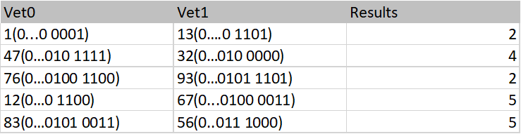

# hamming-distance
The hamming function inserts in the n-th cell the hamming distance between the n-th cells from 2 different vectors.  
The main passes to the hamming function the parameters and prints the results. 
The hamming function receives:
- first vector
- second vector
- vector of the results
- dimension of the vectors 

Example: 

# Technologies
- assembly MIPS